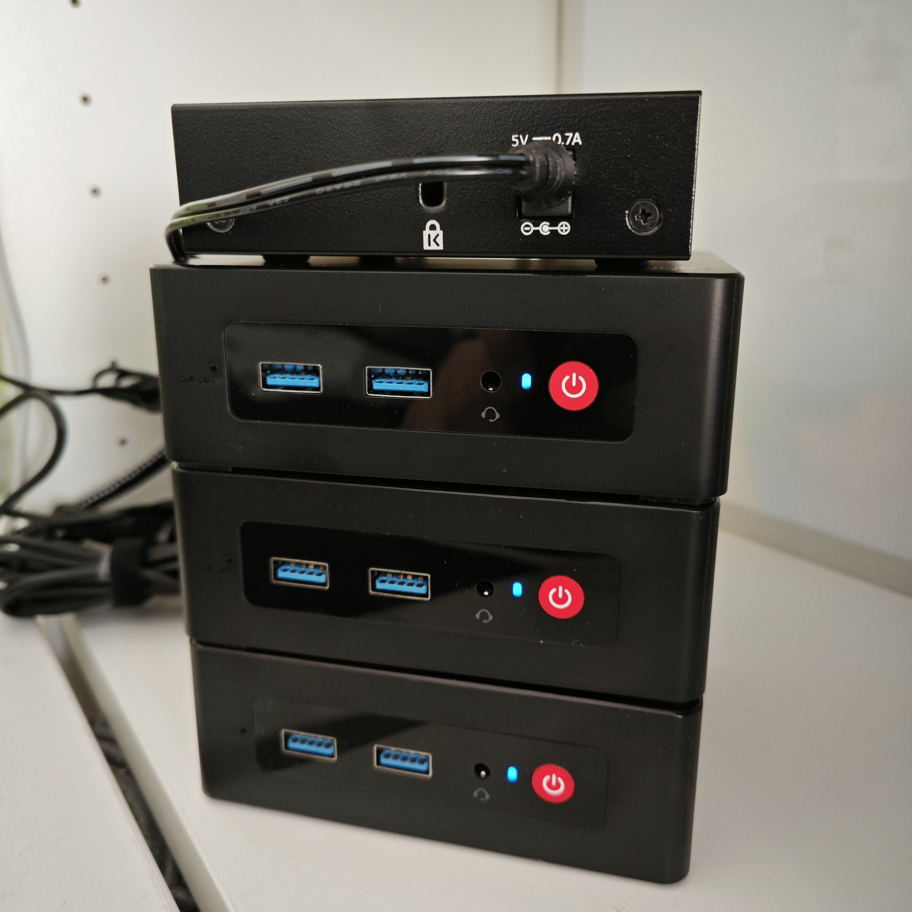

# Homelab

This repository contains the configuration files and scripts for my homelab.
It is an evolving project that I use to learn, test, and experiment with new
technologies.

The main areas of interest are:
- System Administration
- Automation
- Virtualization
- Containerization
- Networking
- Security
- Monitoring
- etc.

## Hardware



- 4 × Trigkey Green G4 Mini PC
    - CPU: Intel® Processor N100 @ 3.40GHz
    - RAM: 16GB
    - SSD: 512GB
- Netgear GS305v3 switch:
    - Ports: 4
    - Speed: 1000Mbps

## Preparation

This repository uses Ubuntu 24.04 LTS as the control workstation to work with
homelab devices.

1. Install Git:

    ```bash
    sudo apt install git
    ```

2. Clone repository:

    ```bash
    git clone https://github.com/ivanlemeshev/homelab.git
    cd homelab
    ```

3. Update the system and install the required packages:

    ```bash
    ./scripts/prepare-control-workstation.sh
    ```
